# Utilisation du logiciel

## Réglages

### Réglages globaux

La première chose à faire est de régler les paramètres globaux du logiciel. Ces paramètres sont accessibles via le
menu "Préférences" dans la barre de menu.
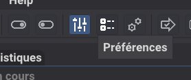

La fenêtre se présente comme:
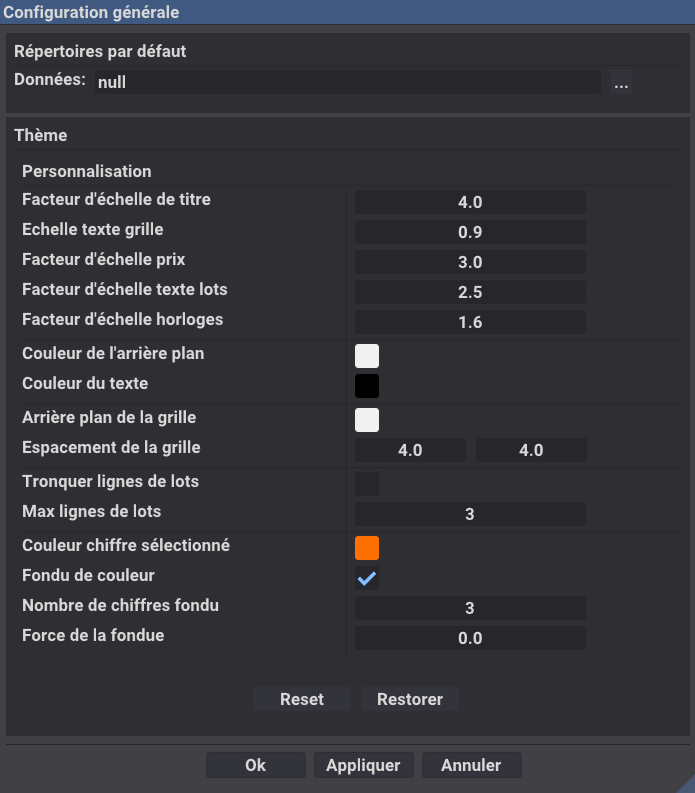

Il est très important de régler correctement les paramètres globaux avant de commencer à créer un événement, car ces
paramètres seront utilisés par défaut pour tous les événements créés. Il est possible de les modifier pour chaque
événement, mais il est recommandé de les régler correctement dès le départ.

**En particulier, bien saisir le répertoire de données par défaut, celui-ci servira pour placer le fichier
de sauvegarde automatique.** Ce fichier est très important, il permet de récupérer les données en cas de plantage du
logiciel ou
de fermeture accidentelle. Il est donc recommandé de choisir un répertoire où vous avez l'habitude de sauvegarder vos
données, et de ne pas le changer trop souvent.

Les paramètre de thème permettent de régler les couleurs et les polices utilisées par le logiciel.
Il est possible de choisir parmi plusieurs thèmes prédéfinis, ou de créer son propre thème en modifiant
les couleurs et les polices. Le thème choisi sera utilisé pour tous les événements créés,
mais il est possible de le modifier pour chaque événement.

**Il est recommandé d'adapter le thème le Jour de la manifestation avec le vidéoprojecteur utilisé, et dans
l'environnement de jeu pour que les couleurs soient bien visibles.**

### Réglage événement

Il faut ensuite créer un événement, en cliquant sur "Fichier" > "Nouveau". Un événement est une collection de parties,
qui peuvent être de différents types. Chaque partie peut avoir des paramètres spécifiques, comme le type de partie, les
lots à gagner, etc.
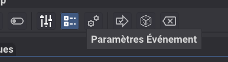

Ensuite, il faut régler les paramètres de l'événement, comme le nom de l'événement, la date, le lieu, etc. Ces
paramètres sont importants pour l'identification de l'événement, et peuvent être utilisés pour générer des rapports de
fin d'événement.
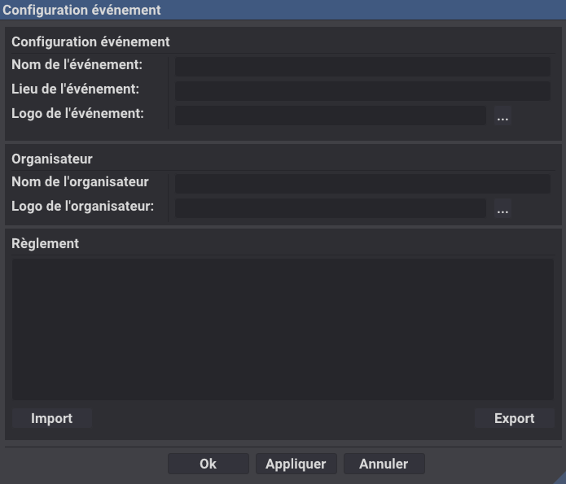

Trois paramètres sont obligatoires pour passer à la phase de réglage des parties:

* le nom de l'événement
* le lieu de l'événement
* Le nom de l'organisateur de l'événement

Il est toutefois conseillé de renseigner les autres paramètres, pour un meilleur affichage et une meilleure
identification de l'événement.

### Réglage des parties

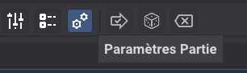

La fenêtre de réglage se compose de trois colonnes, la liste des parties à gauche, les paramètres de la partie au
milieu, et les lots à gagner à droite.
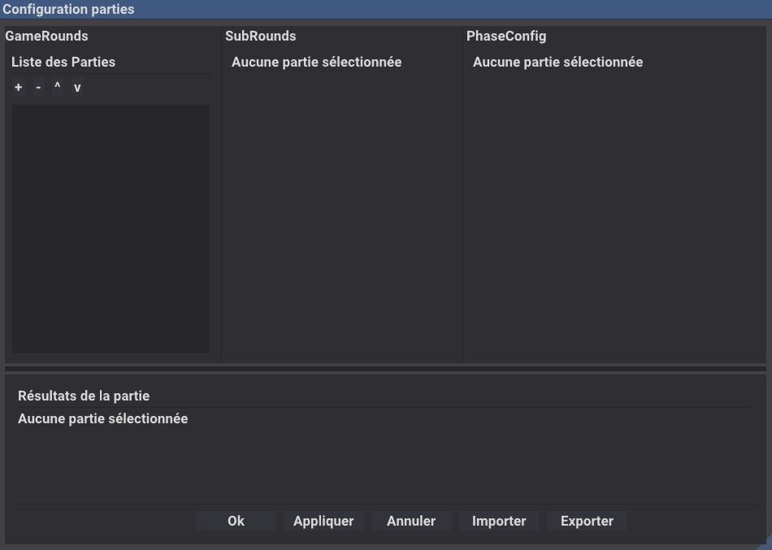

#### Liste des parties

On commence par définir une liste de parties, en cliquant sur le bouton "Ajouter une partie". Chaque partie peut être de
différents types, comme indiqué dans le tableau ci-dessous. Le type de partie détermine les règles de jeu, les lots à
gagner, et les conditions de victoire. Il est important de choisir le type de partie en fonction de l'ambiance que vous
souhaitez créer, du temps disponible, et des préférences des participants.

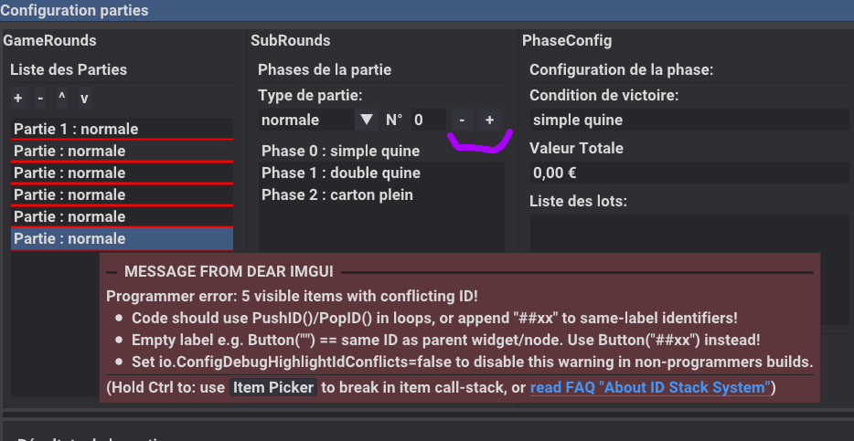

Bien penser à régler le numéro de la partie pour éviter les messages d'erreur lors du déroulement de l'événement. Le
numéro de la partie doit être unique par type, et doit être supérieur à 0, ce numéro sera celui affiché à l'écran.
Les parties de type "Pause" n'ont pas besoin d'avoir un numéro, et peuvent être placées n'importe où dans la liste des
parties.

Les parties peuvent être réorganisées en utilisant les boutons "Monter" et "Descendre". Il est important de bien
organiser les parties pour que le déroulement de l'événement soit fluide et cohérent. Il est recommandé de placer
une partie spéciale avant les pauses pour permettre aux participants d'aller sur la buvette en avance et éviter le
rush.

Un exemple de liste de parties pourrait être :

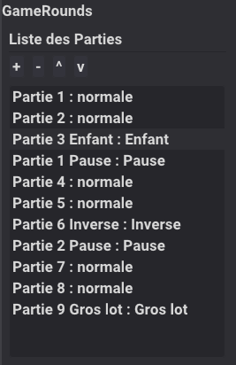

#### Réglage du type de partie

Les types de parties disponibles sont les suivants :
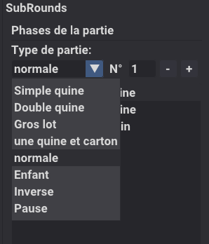

Détail des types de parties :

| Type de partie  | nombre de phase | Description                                                                                         |
|-----------------|-----------------|-----------------------------------------------------------------------------------------------------| 
| Pause           | 1               | Partie spéciale, description détaillée plus loin.                                                   |
| Simple quine    | 1               | Partie classique, le gagnant est le premier qui remplit une quine.                                  |
| Double quine    | 1               | Partie classique, le gagnant est le premier qui remplit une double quine.                           |
| Gros lot        | 1               | Partie classique, le gagnant est le premier qui remplit un carton plein.                            |
| Quine et carton | 2               | 2 phases, une à la quine, l'autre au carton plein.                                                  |
| normale         | 3               | 3 phases, une à la quine, une à la double quine, et une au carton plein.                            |
| Inverse         | 1               | Partie classique, le gagnant est le dernier qui ne remplit aucune case de son carton.               |
| enfant          | n               | partie spéciale enfant. Le premier gagnant est le premier à remplir une quine, puis le second, etc. |

La partie enfant est une partie spéciale, qui permet de faire gagner plusieurs participants. Le nombre de phases est
déterminé par le nombre de gagnants que vous souhaitez faire gagner.

Bien signaler qu'il ne faut pas démarquer les cartons entre chaque phase, mais seulement entre chaque partie, pour que
les gagnants puissent continuer à jouer pour les phases suivantes. Par exemple, dans une partie normale, le premier
gagnant est celui qui remplit une quine, le second gagnant est celui qui remplit une double quine, et le troisième
gagnant est celui qui remplit un carton plein. Si les cartons sont démarqués entre chaque phase, les participants ne
pourront pas continuer à jouer pour les phases suivantes, et cela peut créer de la confusion.

#### Remplissage des lots à gagner

Dernière étape de la configuration d'une partie, le remplissage des lots à gagner. Les lots à gagner sont les
récompenses
que les participants peuvent gagner en remplissant les différentes phases de la partie. Il est important de
remplir correctement les lots à gagner pour que les participants soient motivés à jouer, et pour que l'événement soit
réussi. Il est recommandé de remplir les lots à gagner en fonction du type de partie, du nombre de phases, et du nombre
de gagnants que vous souhaitez faire gagner. Par exemple, pour une partie normale, il est recommandé de remplir les lots
à gagner pour la quine, la double quine, et le carton plein, pour que les participants soient motivés à jouer pour les
différentes phases de la partie.

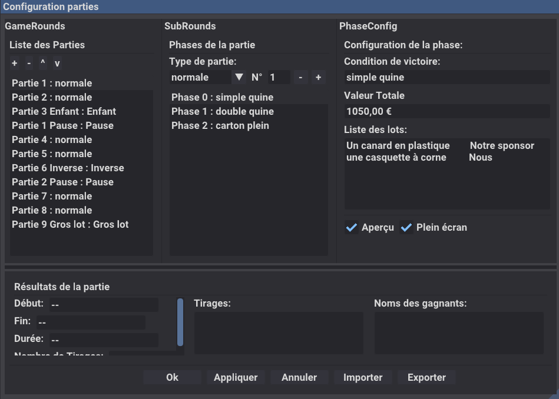

Vous pouvez utiliser le mode Aperçu pour voir à quoi ressemblera l'affichage des lots à gagner pour les participants, et
vous assurer que les lots sont correctement remplis et affichés. Il est important de vérifier que les lots à gagner sont
correctement affichés pour les participants, car cela peut avoir un impact sur leur motivation à jouer, et sur le succès
de l'événement.

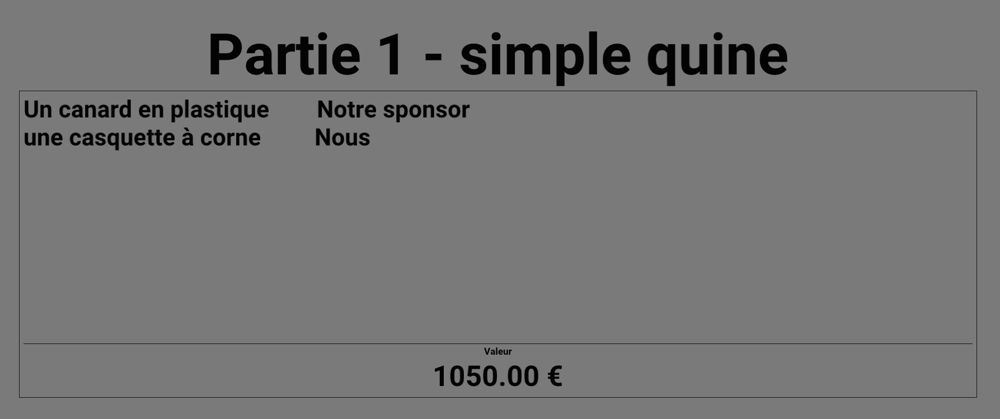

## Déroulement d'un événement

Une fois les parties configurées, il est temps de démarrer l'événement. Pour cela, il suffit de cliquer sur le bouton "
Démarrer l'événement" dans la barre d'outils.

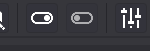

**Attention** : une fois l'événement démarré, il n'est plus possible de modifier les paramètres de l'événement, ni les
paramètres des parties. En tout cas les parties débutées ne sont plus éditables.
Lors de la phase de réglage, pensez à sauvegarder l'événement avant de le débuter et de ne plus faire de sauvegarde pour
pouvoir revenir à la configuration de l'événement si besoin.

Lors du démarrage de l'événement, le logiciel affiche une fenêtre de contrôle pour l'organisateur, et une fenêtre
d'affichage pour les participants. La fenêtre de contrôle permet à l'organisateur de suivre le déroulement de
l'événement, de passer d'une partie à l'autre, et de gérer les différentes phases de chaque partie. La fenêtre
d'affichage
permet aux participants de suivre le déroulement de l'événement, de voir les lots à gagner, et les numéros déjà tirés.

S'il n'y a qu'un seul écran de disponible, la fenêtre de contrôle et la fenêtre d'affichage seront affichées sur le
même écran, avec la fenêtre de contrôle et une fenêtre d'affichage plus petite. Si deux écrans sont disponibles, la
fenêtre de contrôle sera affichée sur l'écran principal, et la fenêtre d'affichage sera affichée sur l'écran secondaire
en plein écran (si plus que deux écrans il sera possible de choisir quel écran sert d'affichage).

### Écran de contrôle

L'écran de contrôle principal affiche les informations suivantes :

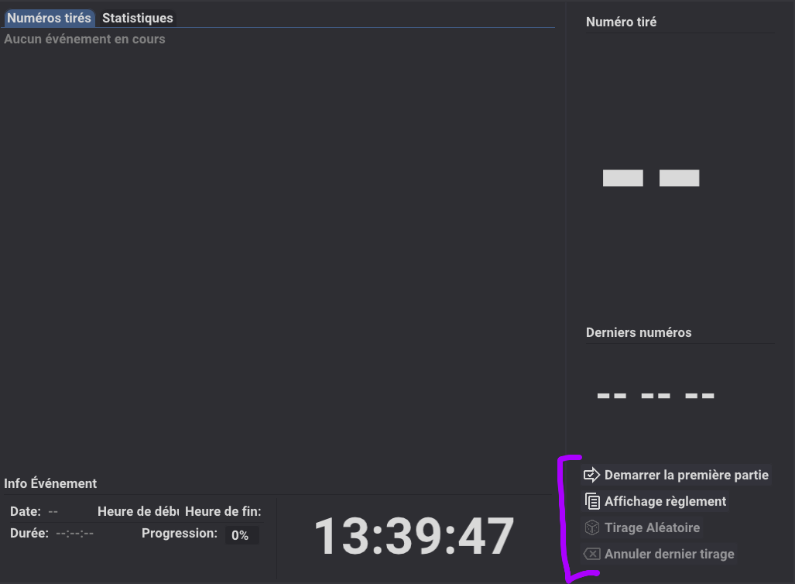

En bas à droite de l'écran de contrôle, il y a les boutons de contrôle pour passer d'une partie à l'autre, et pour gérer
les différentes phases de chaque partie.

Une fois la première partie démarrée, plusieurs modes de tirage sont disponibles pour faire avancer le jeu, le mode
aléatoire où c'est l'ordinateur qui tire les numéros, et le mode manuel où c'est l'organisateur qui tire les numéros à
l'aide d'un boulier traditionnel puis clique sur le bouton correspondant sur le panneau de contrôle.

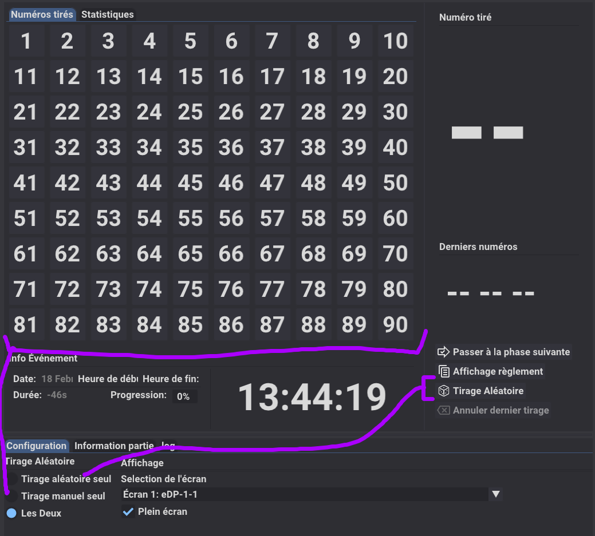

Bien qu'il soit possible de faire les deux modes, il est recommandé de choisir un mode de tirage pour chaque partie, et
de s'y tenir pour éviter la confusion.

Durant une partie les écrans organisateur et d'affichage devrait ressembler à ça :

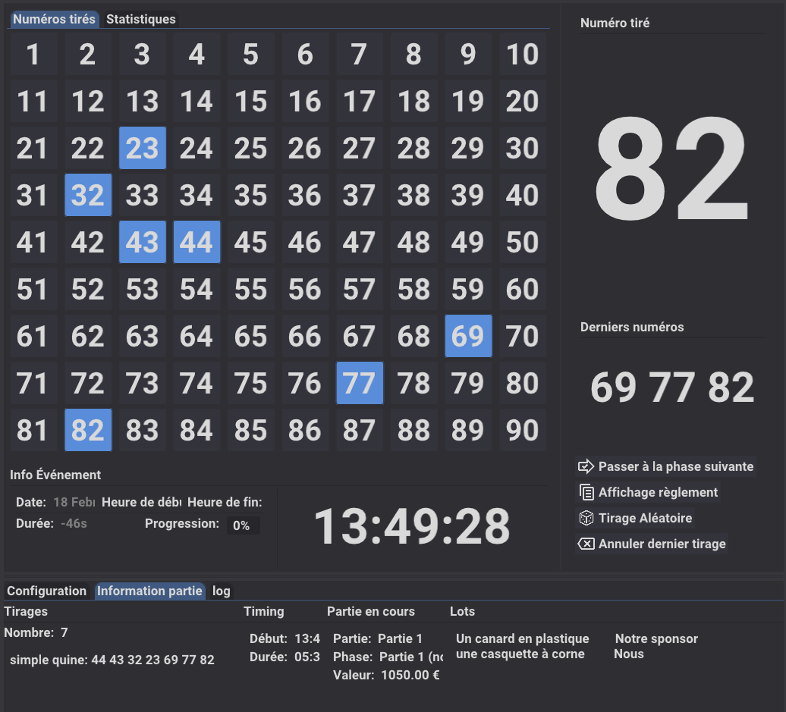
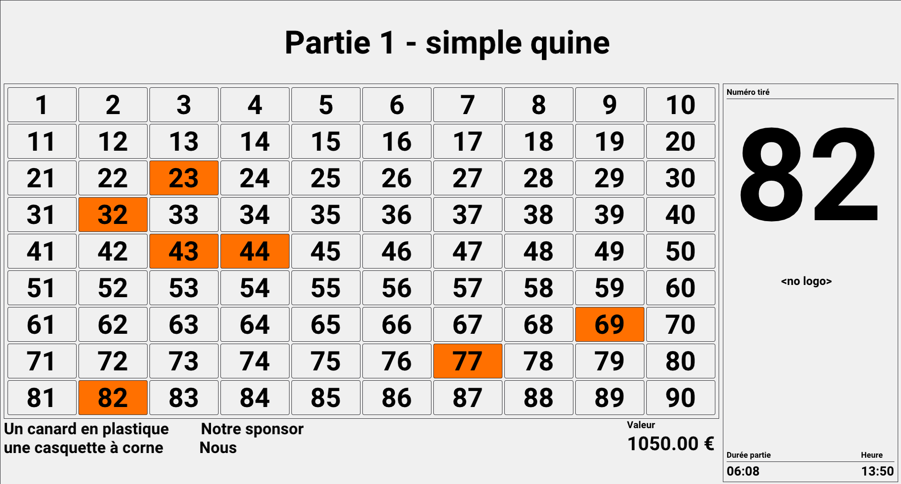

Bonne chance pour votre événement, et n'hésitez pas à nous faire part de vos retours pour améliorer le logiciel !
